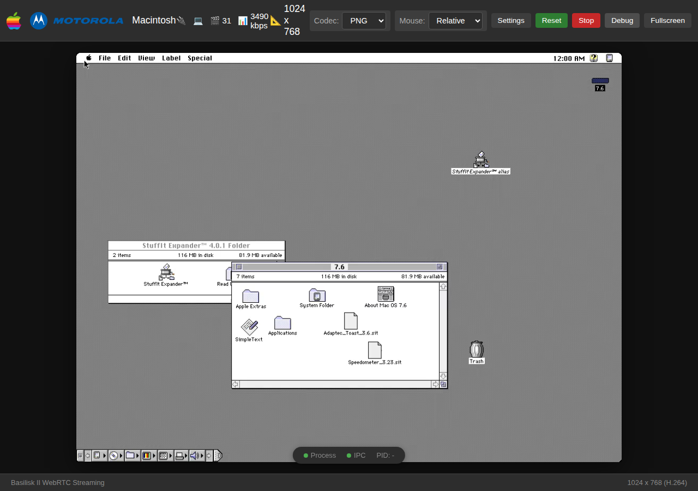
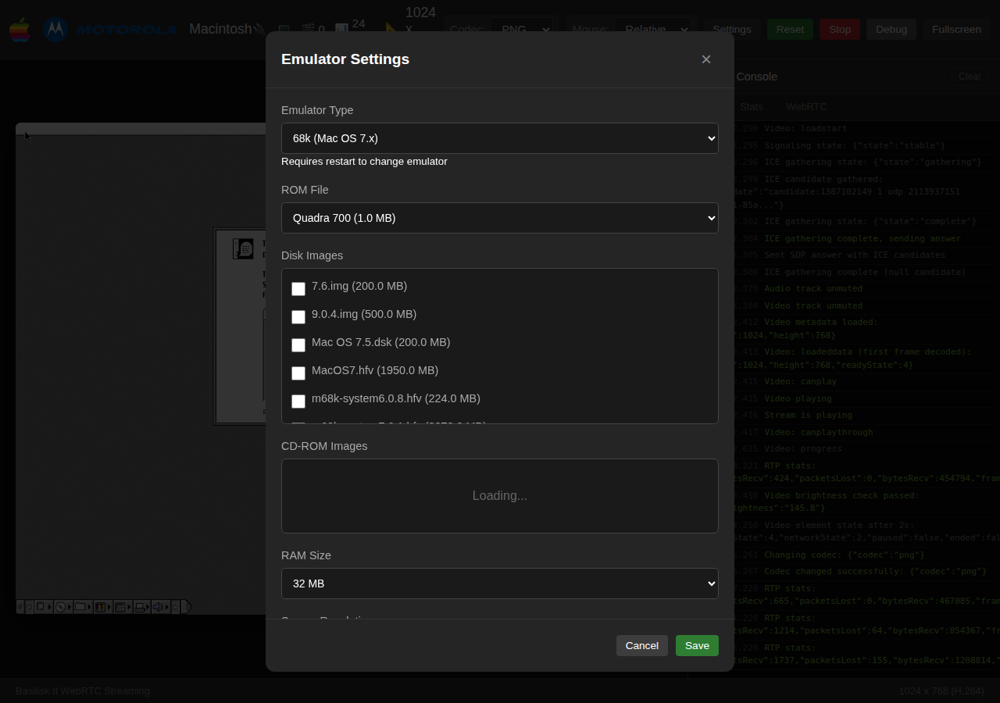

# MacPhoenix

A classic Macintosh emulator that runs in your browser. Boot Mac OS 7.5.5 on an emulated Quadra 650 and interact with it over WebRTC — no native GUI needed.






## What is this?

MacPhoenix is a ground-up rewrite of the [BasiliskII/SheepShaver](https://github.com/kanjitalk755/macemu) emulator family. It replaces the SDL desktop UI with a web-based streaming interface: the emulator runs as a headless server and streams video to your browser via WebRTC, with keyboard and mouse input sent back over a data channel.

### Key features

- **Two CPU backends** — a fast UAE interpreter (~5s boot) and a QEMU-based Unicorn JIT, plus a lockstep dual-CPU mode for validation
- **Browser UI** — connect from any device with a web browser, no plugins or installs
- **WebRTC streaming** — low-latency video with H.264, VP9, AV1, PNG, or WebP encoding
- **REST API** — boot status, screenshots, config, and control via HTTP endpoints
- **Headless mode** — run without any UI for testing and automation

## Quick start

### Ubuntu/Debian setup

```bash
# Build tools
sudo apt install build-essential meson ninja-build cmake pkg-config git

# Required
sudo apt install libssl-dev nlohmann-json3-dev

# Video encoders (optional — enables H.264, VP9, WebP)
sudo apt install libopenh264-dev libvpx-dev libwebp-dev libyuv-dev

# Audio encoder (optional — enables Opus audio)
sudo apt install libopus-dev

# HTTP server (optional — falls back to bundled header)
sudo apt install libcpp-httplib-dev

# Playwright E2E tests (optional)
sudo npx playwright install-deps
```

The only hard requirements are OpenSSL and a C++17 compiler. Video/audio codec packages are optional — without them, the emulator still works using PNG frame streaming.

### Requirements

- Linux (x86_64)
- A Quadra 650 ROM file (1MB)

### Build & run

```bash
# Clone with submodules
git clone --recursive https://github.com/sirmick/mac-phoenix.git
cd mac-phoenix

# Build (Unicorn engine compiles from source on first build)
meson setup build
ninja -C build

# Run
./build/mac-phoenix /path/to/quadra.rom
```

Then open **http://localhost:8000** in your browser.

### Headless mode

```bash
./build/mac-phoenix --timeout 10 --no-webserver /path/to/quadra.rom
```

## CPU backends

| Backend | Engine | Boot time | Use case |
|---------|--------|-----------|----------|
| `uae` (default) | Hand-tuned 68K interpreter | ~5s | General use |
| `unicorn` | QEMU TCG JIT | ~48s | Validation, future optimization |
| `dualcpu` | Both in lockstep | Very slow | Debugging CPU divergences |

Select with `--backend uae|unicorn|dualcpu`.

## Configuration

Settings are stored in `~/.config/mac-phoenix/config.json` (created automatically from the web UI). All fields are optional — a minimal config just needs a ROM and disk:

```json
{
  "rom": "quadra650.rom",
  "disks": ["system.img"],
  "storage_dir": "~/storage"
}
```

Relative paths resolve against `storage_dir` (`roms/` for ROMs, `images/` for disks). CLI flags override config file values. See [docs/JsonConfig.md](docs/JsonConfig.md) for the full schema.

## API

| Endpoint | Description |
|----------|-------------|
| `GET /api/status` | Boot phase, timing, and state |
| `GET /api/screenshot` | PNG of the current screen |
| `GET /api/mouse` | Mac cursor position |
| `GET /api/config` | Current configuration |
| `POST /api/emulator/start` | Start emulation |
| `POST /api/emulator/stop` | Stop emulation |
| `GET /api/storage` | Available ROMs and disk images |
| `POST /api/codec` | Switch video codec |
| `POST /api/keypress` | Send a key event (`{"key": "return"}`) |

## Testing

```bash
# Fast suite (~12s) — API + UAE boot + mouse
meson test -C build api_endpoints boot_uae mouse_position

# Full suite (~60s) — includes Unicorn boot
meson test -C build

# Playwright E2E browser tests
npx playwright test
```

## Architecture

MacPhoenix uses a **Platform API** abstraction: all CPU backends implement the same function pointer table, so core emulation code (ROM patching, interrupt handling, ADB, video) is backend-agnostic.

Video uses a **lock-free triple buffer** — the CPU writes frames, the encoder reads them, and the screenshot API reads them, all without locks.

See [CLAUDE.md](CLAUDE.md) for the full developer reference.

## Heritage

MacPhoenix descends from the BasiliskII/SheepShaver emulator family originally created by Christian Bauer. The original source is preserved in [`legacy/`](legacy/) for reference.

## License

GPL-2.0 — see [LICENSE](LICENSE).
