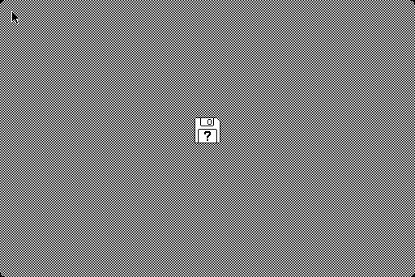

# MacPhoenix

A classic Macintosh emulator that runs in your browser. Boot System 6 through Mac OS 9 and interact with it over WebRTC — no native GUI needed.




## What is this?

MacPhoenix is a ground-up rewrite of the [BasiliskII/SheepShaver](https://github.com/kanjitalk755/macemu) emulator family. It replaces the SDL desktop UI with a web-based streaming interface: the emulator runs as a headless server and streams video to your browser via WebRTC, with keyboard and mouse input sent back over a data channel.

### Key features

- **Multiple Macs** — Mac SE, Quadra 650, and Power Mac G3, with more on the way
- **Browser UI** — connect from any device, no plugins or installs
- **WebRTC streaming** — low-latency video with H.264, VP9, PNG, or WebP encoding
- **REST API** — boot status, screenshots, config, app launching, and control via HTTP endpoints
- **Headless mode** — run without any UI for testing and automation

## Quick start

### 1. Install dependencies (Ubuntu/Debian)

```bash
# Required
sudo apt install build-essential cmake pkg-config git libssl-dev nlohmann-json3-dev libyuv-dev

# Optional — video/audio codecs (PNG streaming works without these)
sudo apt install libopenh264-dev libvpx-dev libwebp-dev libopus-dev
```

### 2. Build

```bash
git clone --recursive https://github.com/sirmick/mac-phoenix.git
cd mac-phoenix
cmake -B build
cmake --build build -j$(nproc)
```

### 3. Run

```bash
./build/mac-phoenix /path/to/quadra.rom
```

Open **http://localhost:8000** in your browser. That's it — you'll see the Mac desktop in a few seconds.

### What you need

- Linux (x86_64)
- A compatible ROM file (not included)

You choose a machine profile, then supply a matching ROM:

| Machine | CPU | Mac OS | Display | ROM needed |
|---------|-----|--------|---------|------------|
| Mac SE | 68000 | System 6 | 512×342 mono | Mac SE (256 KB) |
| Quadra 650 | 68040 | 7.1–7.6 | 640×480 color | Quadra 650 (1 MB) |
| Power Mac G3 | PPC 603e | 8.1–9.2 | Up to 1600×1200 | Power Mac G3 (4 MB) |

The machine profile is auto-detected from the ROM at startup. A disk image is optional — the emulator boots to the ROM's built-in system if no disk is provided.


### Disk images

Python scripts in [`provisioning/`](provisioning/) create and populate HFS/HFS+ disk images from Linux:

```bash
# Create a blank 120 MB HFS disk image
python3 provisioning/create_hfs.py --size 120M --name "Macintosh HD" disk.img

# Populate with 68K installer software
python3 provisioning/populate_68k_installers.py disk.img
```

See [docs/Provisioning.md](docs/Provisioning.md) for the full guide.

## Architectures

MacPhoenix supports two CPU architectures, selected with `--arch`:

```bash
# 68K (default) — machine type auto-detected from ROM
./build/mac-phoenix /path/to/quadra.rom
./build/mac-phoenix /path/to/mac-se.rom --disk /path/to/system6.img

# PowerPC — Power Mac G3 emulation
./build/mac-phoenix --arch ppc /path/to/g3.rom --disk /path/to/macos9.img
```

### 68K CPU backends

The 68K architecture has multiple CPU backends, selected with `--backend`:

| Backend | Engine | Boot time | Use case |
|---------|--------|-----------|----------|
| `uae` (default) | Hand-tuned interpreter | ~5s | General use |
| `unicorn` | QEMU TCG JIT | ~48s | Validation |
| `dualcpu` | Both in lockstep | Very slow | Debugging CPU divergences |

The PPC architecture uses the Kheperix (KPX) interpreter.

## Configuration

Settings are managed through the browser UI and stored in `~/.config/mac-phoenix/config.json`. A minimal config just needs a ROM and disk:

```json
{
  "rom": "quadra650.rom",
  "disks": ["system.img"],
  "storage_dir": "~/storage"
}
```

Relative paths resolve against `storage_dir` (`roms/` for ROMs, `images/` for disks). CLI flags override config file values. See [docs/JsonConfig.md](docs/JsonConfig.md) for the full schema.

## CLI reference

```
./build/mac-phoenix [options] [rom-path]
  --rom PATH            ROM file (alternative to positional arg)
  --disk PATH           Disk image (repeatable)
  --cdrom PATH          CD-ROM image (repeatable)
  --extfs PATH          Shared folder (repeatable)
  --arch m68k|ppc       CPU architecture (default: m68k)
  --backend uae|unicorn Backend selection (68K only, default: uae)
  --ram MB              RAM size in megabytes
  --screen WxH          Display resolution (default: 640x480)
  --port N              HTTP server port (default: 8000)
  --timeout N           Auto-exit after N seconds
  --no-webserver        Headless mode (no HTTP/WebRTC)
  --network MODE        Network: none, socket (default: none)
  --config PATH         JSON config file
  --dismiss-shutdown-dialog  Auto-dismiss improper shutdown dialog on boot
```

## API

| Endpoint | Method | Description |
|----------|--------|-------------|
| `/api/status` | GET | Boot phase, timing, and state |
| `/api/screenshot` | GET | PNG of the current screen |
| `/api/mouse` | GET/POST | Cursor position (GET) or move (POST) |
| `/api/keypress` | POST | Send a key event (`{"key": "return"}`) |
| `/api/config` | GET/POST | Read or update configuration |
| `/api/emulator/start` | POST | Start emulation |
| `/api/emulator/stop` | POST | Stop emulation |
| `/api/storage` | GET | Available ROMs and disk images |
| `/api/codec` | POST | Switch video codec |
| `/api/codecs` | GET | Available codecs and status |
| `/api/app` | GET | Current foreground application |
| `/api/windows` | GET | Window list |
| `/api/wait` | POST | Poll for a condition (`boot=Finder`, `app=Name`) |
| `/api/launch` | POST | Launch an app (`{"path": "HD:App"}`) |
| `/api/quit` | POST | Quit current application |

## Testing

```bash
# Fast suite — API, boot, mouse, command bridge (~15s)
ctest --test-dir build -L api

# Full suite — includes slow Unicorn boot (~60s)
ctest --test-dir build

# Playwright E2E — browser UI + WebRTC (~2 min)
npx playwright test
```

See [docs/Testing.md](docs/Testing.md) for details.

## Architecture

MacPhoenix uses a **Platform API** abstraction: all CPU backends implement the same function pointer table, so core code (ROM patching, interrupts, ADB, video) is backend-agnostic. Video uses a **lock-free triple buffer** — the CPU writes frames, the encoder reads them, and the screenshot API reads them, all without locks.

See [CLAUDE.md](CLAUDE.md) for the full developer reference.

## Heritage

MacPhoenix descends from the BasiliskII/SheepShaver emulator family originally created by Christian Bauer. The original source is preserved in [`legacy/`](legacy/) for reference.

## License

GPL-2.0 — see [LICENSE](LICENSE).
