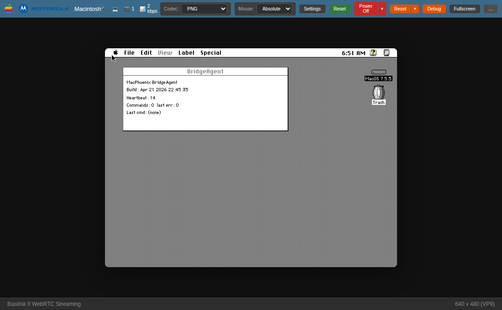
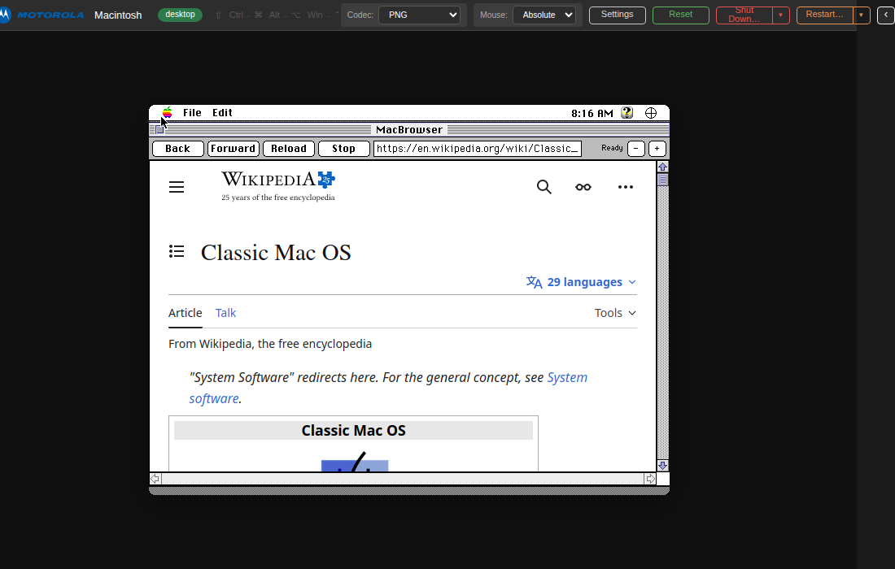
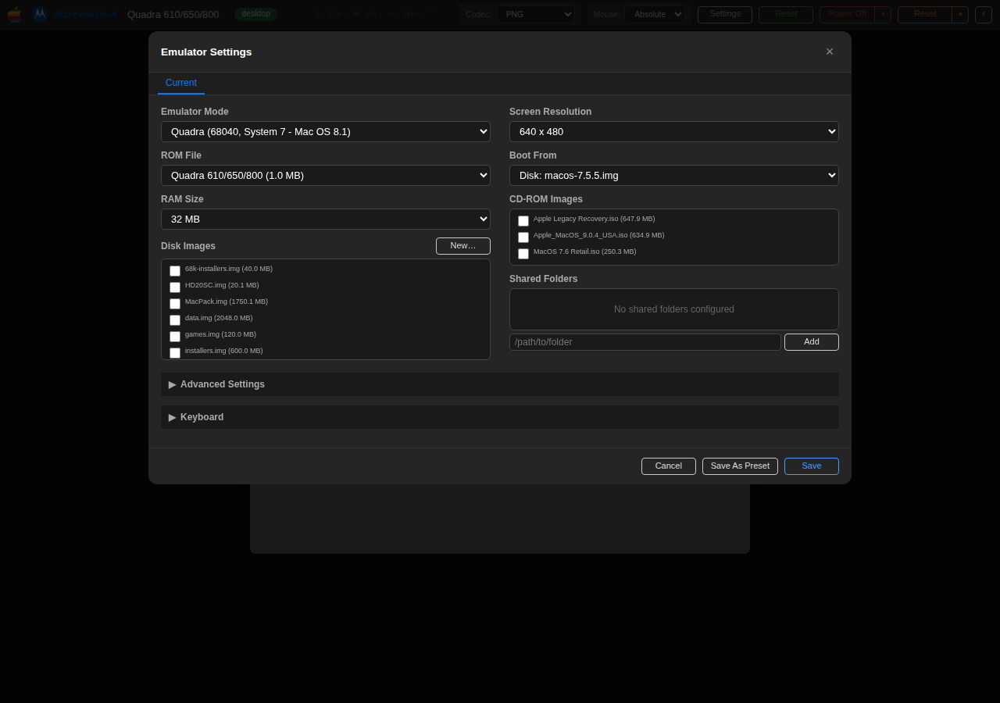

# MacPhoenix

A classic Macintosh emulator that runs in your browser. Boot System 6 through Mac OS 9 and interact with it over WebRTC — no native GUI needed.




## What is this?

MacPhoenix is a ground-up rewrite of the [BasiliskII/SheepShaver](https://github.com/kanjitalk755/macemu) emulator family. It replaces the SDL desktop UI with a web-based streaming interface: the emulator runs as a headless server on a single HTTP port and streams video to your browser. Everything — static UI, REST API, WebSocket signaling, PNG/WebP frames, and input — rides that one port; H.264/VP9 add a WebRTC media path for LAN use.

Most-tested guest OS versions: **System 6.0.8**, **System 7.5.5**, **Mac OS 7.6.1**, and **Mac OS 9.0.4**. Other 7.x / 8.x / 9.x releases mostly work; file a bug if they don't.

### Key features

- **Multiple Macs** — Mac SE, Quadra 650, and Power Mac G3, with more on the way
- **Browser UI** — connect from any device, no plugins or installs
- **Single-port deploy** — HTTP, WebSocket signaling, PNG/WebP frames, and the HTTP-stream fallback all share one TCP listener; trivial to put behind nginx or Caddy
- **Three transport modes** — WebSocket for PNG/WebP (works through any HTTPS proxy), HTTP long-poll for locked-down networks, WebRTC RTP for H.264/VP9 on LAN
- **REST API** — boot status, screenshots, config, app launching, and control via HTTP endpoints
- **Automation bridge** — launch classic apps, graceful guest shutdown and restart, and bidirectional TEXT-scrap clipboard sync between browser and Mac OS
- **MacBrowser** — modern web inside System 7: a native Mac app whose viewport is filled live with pixels from a host-side Firefox-on-Xvfb (`--browser`). Works around the three intractable problems with running 1996-era browsers on the modern web (TLS handshake, cert imports, 25 MHz HTML/CSS/JS).
- **Optional audio** — opt-in Opus-encoded audio streaming over WebRTC (`--audio`)
- **NAT networking** — optional Unix-socket bridge (smoltcp + NAT) so the guest can reach the Internet without root
- **Peer-to-peer between guests** — multiple emulators share one bridge as a virtual ethernet segment; AppleTalk file sharing and Chooser see each other natively, IP between guests routes via the bridge's L2 switch (no NAT involved for intra-segment traffic)
- **Headless mode** — run without any UI for testing and automation

## Quick start

### 1. Install dependencies (Ubuntu 24.04)

The emulator itself, the optional Rust net-bridge, and the optional Retro68
toolchain (for rebuilding the guest BridgeAgent) each need a different set
of apt packages. Install only what you need.

#### Emulator (always required)

```bash
# Toolchain + the two libraries CMake hard-requires
sudo apt install build-essential cmake pkg-config git \
                 libssl-dev libyuv-dev
```

`nlohmann_json` is bundled as a git submodule — do **not** install
`nlohmann-json3-dev`; the system header silently masks the bundled copy
and broke our packaging build until we caught it.

#### Optional video/audio codecs

Each one is auto-detected at configure time and shows up in the browser
UI only if present. PNG is always available with no external library.

```bash
sudo apt install libopenh264-dev   # H.264 (WebRTC)
sudo apt install libvpx-dev        # VP9   (WebRTC)
sudo apt install libwebp-dev       # WebP  (WebSocket fallback)
sudo apt install libopus-dev       # Opus audio
```

Re-run `cmake -B build` after installing one of these — the CMake summary
prints which codecs were detected.

#### Net-bridge (optional — for guest networking)

```bash
sudo apt install cargo rustc
```

Apt rust is enough on Ubuntu 24.04, Fedora 40, and Debian 12-bpo.
Older releases (Ubuntu 22.04, Debian 12 stock) need a newer toolchain
via rustup, or skip the net-bridge:

```bash
# Option A — rustup (only needed on pre-24.04 / pre-bpo)
curl --proto '=https' --tlsv1.2 -sSf https://sh.rustup.rs | sh -s -- -y
. "$HOME/.cargo/env"

# Option B — skip the net-bridge entirely
cmake -B build -DBUILD_NET_BRIDGE=OFF
```

The net-bridge is what `--network socket` uses; everything else (boot,
video, input, automation bridge) works fine without it.

#### BridgeAgent (optional — to rebuild the guest helper from source)

The committed `BridgeAgent/BridgeAgent.bin` is what gets
installed into your Mac OS guest's Startup Items, so most users never
need to rebuild it. To rebuild from C source you need the Retro68
m68k cross-toolchain:

```bash
# Build deps for Retro68 itself (one-time, ~30 min compile)
sudo apt install cmake bison flex ruby texinfo \
                 libgmp-dev libmpfr-dev libmpc-dev \
                 libboost-all-dev

# Build the toolchain — installs to ./toolchain/retro68/
provisioning/build_retro68.sh
```

After the toolchain is in `toolchain/retro68/`, `cmake -B build` picks
it up automatically and rebuilds `BridgeAgent.bin` whenever
`BridgeAgent/BridgeAgent.c` changes. To skip:

```bash
cmake -B build -DBUILD_BRIDGE_AGENT=OFF
```

#### MacBrowser (optional — Firefox-on-Xvfb pipeline for `--browser`)

The `--browser` flag spawns a host-side `Xvfb` + `Firefox` and pipes
the rendered pixels into a guest Mac app called MacBrowser. Two
runtime deps:

```bash
sudo apt install xvfb                      # virtual X server
# Install Firefox via Mozilla's tarball, NOT the snap (the snap's
# sandbox + auto-update don't compose with Xvfb):
#   https://www.mozilla.org/firefox/all/
# Extract to /opt/firefox/ (the supervisor probes that path first).
```

The committed `MacBrowser/MacBrowser.bin` is what gets loaded inside
the guest; rebuilding from source uses the same Retro68 toolchain as
BridgeAgent (see above) and is wired into `cmake --build build`. To
skip the rebuild:

```bash
cmake -B build -DBUILD_MAC_BROWSER=OFF
```

To run, mount the floppy and pass `--browser`:

```bash
./build/mac-phoenix --browser \
  --disk MacBrowser/MacBrowser.dsk \
  --bridge \
  /path/to/quadra.rom
```

Then double-click **MacBrowser** on the floppy inside the guest.



See [`docs/MacBrowser.md`](docs/MacBrowser.md) for the protocol
and architecture deep-dive.

#### Provisioning tools (optional — for creating HFS disk images)

```bash
sudo apt install hfsutils unar
```

#### macOS

macOS equivalents for the codec libs are in [CLAUDE.md](CLAUDE.md#optional-codec-dependencies).
For Retro68 on macOS, use Homebrew (`brew install bison flex ruby
texinfo gmp mpfr libmpc boost`).

### 2. Build

```bash
git clone --recursive https://github.com/sirmick/mac-phoenix.git
cd mac-phoenix
cmake -B build
cmake --build build -j$(nproc)
```

`cmake -B build` probes for OpenH264 / VP9 / WebP / Opus / libyuv and prints which codecs were found — re-run it after installing additional encoder libraries.

### 3. Run

```bash
./build/mac-phoenix /path/to/quadra.rom
```

Open **http://localhost:11000** in your browser. That's it — you'll see the Mac desktop in a few seconds.

### What you need

- Linux (x86_64)
- A compatible ROM file (not included)

You choose a machine profile, then supply a matching ROM:

| Machine | CPU | Mac OS | Display | ROM needed |
|---------|-----|--------|---------|------------|
| Mac SE | 68000 | System 6 | 512×342 mono | Mac SE (256 KB) |
| Quadra 650 | 68040 | 7.1–7.6 | 640×480 color | Quadra 650 (1 MB) |
| Power Mac G3 | PPC 603e | 8.1–9.2 | Up to 1600×1200 | Power Mac G3 (4 MB) |

The machine profile (CPU type, FPU, screen size, 24- vs 32-bit mode, disk refnum, …) is **auto-detected from the ROM version word at startup** — you never need to tell the emulator which Mac to be, just hand it the right ROM. A disk image is optional; without one the emulator boots to the ROM's built-in system.



### Storage layout

MacPhoenix resolves relative ROM and disk paths against `storage_dir` (default `~/storage`):

```
~/storage/
  roms/         ROM files (*.rom) — scanned recursively, shown in Settings → ROM File
  images/       Hard-disk and CD-ROM images (*.img, *.dsk, *.iso, *.toast, …)
  installers/   Free-form dump of .sit / .hqx / .bin / .img / .dsk installers
                — the source tree for `populate_disk.py` (see below)
```

Absolute paths work too. Override the root with `--storage-dir /some/where` or `"storage_dir": "/some/where"` in the config file.

### Disk images

Python scripts in [`provisioning/`](provisioning/) create and populate HFS / HFS+ disk images from Linux. They shell out to `hfsutils` and `unar` (installed above).

```bash
# Create a blank 120 MB HFS image at ~/storage/images/fresh.img
# (parent directory is auto-created if missing)
python3 provisioning/create_hfs.py -o ~/storage/images/fresh.img \
                                   -s 120M -n "Macintosh HD"

# Same for HFS+ (Mac OS 8.1+)
python3 provisioning/create_hfs_plus.py -o ~/storage/images/os9.img \
                                        -s 500M -n "Macintosh HD"

# Walk ~/storage/installers/ and copy every supported archive / image onto
# disk.img, preserving resource forks via MacBinary. Subdirectory layout
# is mirrored into the HFS volume.
python3 provisioning/populate_disk.py -i ~/storage/images/fresh.img
#   -s /other/src        use a different source (default: ~/storage/installers)
#   --dry-run            print planned operations without writing

# Bless a System Folder so the image is bootable
python3 provisioning/hfs_bless.py ~/storage/images/fresh.img
```

`populate_disk.py` dispatches each file by extension:

| Extension | Handling |
|-----------|----------|
| `.sit` / `.sea` / `.hqx` / `.bin` | Extract with `unar` and rebuild MacBinary so both forks survive |
| `.img_.bin` | MacBinary-wrapped disk image (raw extract + MacBinary copy) |
| `.img` / `.iso` / `.toast` / `.dsk` | Raw data-fork copy |
| `.dsk` | If it looks like an HFS volume, recursively copied out |

Drop whatever 68K or PPC software you have into `~/storage/installers/` — subfolders become folders on the target volume — and re-run `populate_disk.py` whenever you add more. The directory is *yours*; no schema is enforced. If the installers directory doesn't exist the script creates an empty one and exits so you know where to put things.

See [docs/Provisioning.md](docs/Provisioning.md) for the full guide (including Retro68, MPW, and `hfsutils` internals).

## CPU backends

MacPhoenix selects its CPU emulator with `--backend`. The chosen backend
implies the CPU architecture — there is no separate `--arch` flag.

```bash
# 68K (default) — machine type auto-detected from ROM
./build/mac-phoenix /path/to/quadra.rom
./build/mac-phoenix /path/to/mac-se.rom --disk /path/to/system6.img

# PowerPC — Power Mac G3 emulation (KPX is the default PPC backend)
./build/mac-phoenix --backend kpx /path/to/g3.rom --disk /path/to/macos9.img
```

| Backend | Arch | Engine | Boot time | Use case |
|---------|------|--------|-----------|----------|
| `uae` (default) | m68k | Hand-tuned interpreter (+ optional `--jit`) | ~5s | General use |
| `unicorn-m68k` | m68k | QEMU TCG | ~48s | Validation / perf work |
| `unicorn-ppc`  | ppc  | QEMU TCG | slow | PPC validation |
| `kpx` | ppc | KPX translator (+ optional `--jit`, + optional `--jit68k`) | medium | Default PPC |
| `dualcpu` | m68k | UAE + Unicorn lockstep | very slow | Debugging divergences |

### PowerPC prerequisite: `vm.mmap_min_addr`

PPC emulation runs in real-addressing mode and maps guest RAM at host virtual address 0. On most Linux distributions the kernel refuses `mmap(NULL, …)` by default (`vm.mmap_min_addr=65536`), which shows up as:

```
[CPUContext] ERROR: Failed to map RAM at address 0
[CPUContext] (Run: sudo sysctl vm.mmap_min_addr=0)
```

Allow it once per boot:

```bash
sudo sysctl vm.mmap_min_addr=0
# Persist:
echo 'vm.mmap_min_addr = 0' | \
    sudo tee /etc/sysctl.d/99-mac-phoenix-ppc.conf
```

This is only needed for the PPC backends (`kpx`, `unicorn-ppc`); 68K emulation is unaffected.

## Web UI

Everything you need for day-to-day use lives in the browser. The top toolbar has:

- **Codec** selector — switch H.264 / VP9 / PNG / WebP live (only codecs compiled in appear here).
- **Mouse mode** — absolute (normal) or relative (captured pointer, needed for some games).
- **Settings** — machine/ROM/RAM/disks/CDs/screen + an advanced section for CPU backend, FPU, JIT, network, and the automation bridge.
- **Start / Power Off ▾ / Reset ▾** — the split buttons distinguish a hard kill (immediate `SIGTERM`) from a graceful **Shut Down…** / **Restart…** (routed through the bridge — see below).
- **Debug** — invokes the Programmer's Key (NMI on 68K, Cmd+Power on PPC).
- **Logs** — toggles a live debug pane with tabs for **Clipboard** (bidirectional TEXT scrap sync with the host / browser), **Log**, **Stats**, **WebRTC**, and **Mac** (scrap, WindowList, and command-bridge state).
- **Fullscreen**.

The Settings dialog supports named presets and saves changes into `~/.config/mac-phoenix/config.json`. Most changes take effect on the next emulator start; codec and mouse mode apply immediately.

**Create Disk Image** (Settings → Disk Images → New…) wraps `create_hfs.py` / `create_hfs_plus.py` — new images land in `storage_dir/images/`.

## Configuration

Settings are managed through the browser UI and stored in `~/.config/mac-phoenix/config.json`. A minimal config just needs a ROM and disk:

```json
{
  "rom": "quadra650.rom",
  "disks": ["system.img"],
  "storage_dir": "~/storage"
}
```

Relative paths resolve against `storage_dir` (`roms/` for ROMs, `images/` for disks and CD-ROMs). CLI flags override config file values and are never saved back. Commonly set fields:

| Field | Default | Notes |
|-------|---------|-------|
| `backend` | `"uae"` | `"uae"`, `"unicorn-m68k"`, `"unicorn-ppc"`, `"kpx"`, `"dualcpu"` |
| `jit` | `false` | Enable backend's primary JIT (uae, kpx) |
| `jit68k` | `true` | Enable 68k-on-PPC DR JIT (kpx only) |
| `idlewait` | `true` | Pause CPU when guest is idle |
| `ram_mb` | `64` | |
| `rom`, `disks`, `cdroms` | — | Absolute or relative to `storage_dir` |
| `extfs` | `""` | Shared host folder (repeatable in the UI) |
| `screen` | `"640x480"` | `"WxH"` |
| `codec` | `"vp9"` | `"png"`, `"h264"`, `"vp9"`, `"webp"`, `"httpstream"` |
| `mousemode` | `"absolute"` | `"absolute"` or `"relative"` |
| `http_port` | `11000` | Serves HTTP, `/ws` WebSocket signaling + frames, and `/api/frame` long-poll — one port |
| `bridge_enabled` | `false` | Enable the automation bridge (see below) |
| `audio` | `false` | Enable Opus audio emulation (opt-in) |
| `dismiss_shutdown_dialog` | `true` | Auto-dismiss the improper-shutdown dialog on boot (set `false` if you want to see it) |
| `log_level` | `0` | 0 = milestones, 3 = + registers |

Legacy `architecture` + `cpu_backend` + `m68k.*` / `ppc.*` keys are accepted on
load with a one-time deprecation warning, then dropped on first save. See
[docs/JsonConfig.md](docs/JsonConfig.md) for the full schema.

## CLI reference

```
./build/mac-phoenix [options] [rom-path]
  --rom PATH                 ROM file (alternative to positional arg)
  --disk PATH                Disk image (repeatable)
  --cdrom PATH               CD-ROM image (repeatable)
  --extfs PATH               Shared host folder (repeatable)
  --bootdriver N             0=any, -62=CD-ROM (default: 0)
  --storage-dir PATH         Root for relative rom/disk paths (default: ~/storage)
  --backend NAME             uae | unicorn-m68k | unicorn-ppc | kpx | dualcpu
                             (default: uae; backend implies architecture)
  --jit / --no-jit           Enable backend's primary JIT (uae, kpx)
  --jit68k / --no-jit68k     Enable 68k-on-PPC DR JIT (kpx only, default: on)
  --idlewait / --no-idlewait Pause CPU when guest is idle (default: on)
  --ram MB                   RAM size in megabytes (default: 64)
  --screen WxH               Display resolution (default: 640x480)
  --port N                   HTTP server port (default: 11000) — also hosts /ws signaling
  --timeout N                Auto-exit after N seconds (useful for tests)
  --no-webserver             Headless mode (no HTTP / WebRTC)
  --network MODE             Network: none | socket[:<unix-socket-path>]
  --bridge                   Enable the automation bridge (BridgeAgent + ExtFS)
  --browser                  Run MacBrowser (Firefox-on-Xvfb pipeline)
  --headless-http            HTTP API only (no video/audio); implies --bridge
  --audio                    Enable audio emulation (Opus over WebRTC; default: off)
  --config PATH              JSON config file (use /dev/null to ignore user config)
  --zap-pram                 Clear PRAM on startup
  --dismiss-shutdown-dialog / --no-dismiss-shutdown-dialog
                             Auto-dismiss the improper-shutdown dialog on boot (default: on)
  --screenshots              Dump PPM framebuffer snapshots to /tmp
  --log-level N              Log verbosity 0-3
  --debug-connection         Log WebRTC connection details
  --debug-mode-switch        Log video mode switches
  --debug-perf               Log performance counters
  --debug-network            Log lwIP NAT/DNS/ICMP/TCP/UDP
  -h, --help                 This help
```

CLI flags always win over the config file. The emulator binary does not read environment variables — test scripts use `MACEMU_ROM` / `MACEMU_DISK`, but the binary itself does not.

## Automation bridge

Launch apps, quit apps, and trigger a graceful guest-OS shutdown or restart — all over HTTP. Enable with `--bridge` (or `bridge_enabled: true`, or the Settings → "Enable automation bridge" checkbox). `--no-webserver` mode turns it on automatically for test scripts.

How it works:

- **Read commands** (`/api/app`, `/api/windows`, `/api/wait`) peek Mac low memory (`CurApName`, `WindowList`, `Ticks`) directly from the 60 Hz IRQ — no guest cooperation required.
- **Action commands** (`/api/launch`, `/api/quit`, `/api/shutdown`, `/api/restart`) write a request file into the bridge directory. A tiny guest-side app (`BridgeAgent`, a Retro68-built m68k binary) installed in `:System Folder:Startup Items:` picks it up in its `WaitNextEvent` loop and drives the Process Manager / Shutdown Manager / Apple Events.

When `--bridge` is on, a fresh temp directory is created under `/tmp/macemu-bridge-XXXXXX` and auto-mounted as ExtFS volume `Host:` inside the guest. `provisioning/install_bridge_agent.sh` is invoked against every `--disk` to (re)install `BridgeAgent.bin` into the System Folder. A watchdog looks for a `bridge_heartbeat` file once the Finder is up and logs a warning if the agent never reports in.

```bash
# Launch an app and wait for it to come up
curl -s -X POST http://localhost:11000/api/launch \
     -d '{"path":"Macintosh HD:Applications:TeachText"}'
curl -s -X POST http://localhost:11000/api/wait \
     -d '{"app":"TeachText","timeout":10}'

# Graceful power-off (quits every app, then ShutDwnPower)
curl -s -X POST http://localhost:11000/api/shutdown
```

See [docs/CommandBridge.md](docs/CommandBridge.md) for the full protocol and the list of files exchanged in the bridge directory.

## Networking

Guest networking is an opt-in `net-bridge` sidecar written in Rust (`net-bridge/`). It pairs a userspace TCP/IP stack (`smoltcp`) with a NAT that proxies the guest's TCP / UDP / ICMP through ordinary host sockets — so the Mac can reach the Internet without raw sockets, `CAP_NET_ADMIN`, or a TUN/TAP device. The bridge also runs a tiny DHCP server, so classic MacTCP / Open Transport just works with "Configure via DHCP".

Default addressing:

| Role | Value |
|------|-------|
| Gateway (bridge) | `10.0.2.1` |
| Netmask | `255.255.255.0` |
| Guest (via DHCP) | `10.0.2.x` |

### Building the bridge

```bash
cargo build --release --manifest-path net-bridge/Cargo.toml
# Produces net-bridge/target/release/net-bridge
```

### Enabling it

Pick **NAT (net-bridge)** in Settings → Network, or launch with `--network socket`:

```bash
./build/mac-phoenix --network socket /path/to/quadra.rom
```

The emulator auto-spawns `net-bridge` over a Unix socket (default `/tmp/mac-ether.sock`) — it looks in `./net-bridge/target/release/`, `./net-bridge/`, and `/usr/local/bin/` in that order. Override the socket path with `--network socket:/some/where.sock`.

If you'd rather manage the bridge yourself (e.g. attach `strace`, run under `valgrind`):

```bash
# Terminal 1
./net-bridge/target/release/net-bridge --socket /tmp/mac-ether.sock

# Terminal 2 — emulator connects to the existing socket
./build/mac-phoenix --network socket:/tmp/mac-ether.sock /path/to/quadra.rom
```

Once the guest has an IP, MacTCP / Open Transport / Internet Config just works — try Netscape, Fetch, NCSA Telnet, iCab, or `curl` inside MPW. `--debug-network` turns on verbose packet logging on the emulator side; `RUST_LOG=debug` does the same for `net-bridge`.

The bridge also exposes a tiny echo service on the gateway (`10.0.2.1:7`, both TCP and UDP) — handy for round-trip smoke tests from inside the guest without needing the host to run an `inetd`-style daemon.

### Multiple guests on one bridge (peer-to-peer + AppleTalk)

`net-bridge` is a multi-port virtual ethernet switch, not a 1:1 tunnel. Start two `mac-phoenix` instances and they automatically share one bridge:

```bash
./build/mac-phoenix --port 8001 --network socket --disk macos-7.6.1.img quadra.rom &
./build/mac-phoenix --port 8002 --network socket --disk macos-7.5.5.img quadra.rom &
```

The first one to start spawns `net-bridge` at `/tmp/mac-ether.sock`; subsequent instances detect the running bridge via `connect()` and join it. Each emulator gets a unique MAC address derived from its PID (`02:50:48:58:<pidhi>:<pidlo>`), and the bridge's per-MAC DHCP pool hands out distinct leases (`10.0.2.15`, `10.0.2.16`, …).

What flows guest-to-guest:

- **IP** — once both guests have configured TCP/IP for DHCP, `ping 10.0.2.16` from the other Mac just works. Inter-guest unicast routes through the bridge's L2 switch directly; no host NAT involved.
- **AppleTalk** — turn on AppleTalk in each guest (control panel → Connect-via Ethernet) and Chooser sees the other Mac for File Sharing, AppleShare, and printer sharing. The bridge passes EtherTalk Phase 2 frames (ethertypes `0x809B` DDP and `0x80F3` AARP) between ports as opaque ethernet — no AppleTalk stack on the host required, the classic Mac OS stacks talk to each other directly.
- **Broadcasts and multicast** — ARP, NBP lookups, and AppleTalk multicast (`09:00:07:*`) flood across all ports the way a real ethernet hub would.

`--network socket:/path/to/other.sock` opts out of the shared default for instances you want isolated on their own bridge. There's no UI control needed for the common case — the join-or-spawn behavior is automatic.

### Ping (ICMP echo)

`net-bridge` proxies ICMP through Linux's *unprivileged* ICMP datagram sockets — no `CAP_NET_RAW` needed — but the kernel still gates them on the `net.ipv4.ping_group_range` sysctl. If guest `ping` returns "host unreachable" while TCP / UDP / DNS / traceroute all work, your gid is outside the range. Allow everyone:

```bash
sudo sysctl -w net.ipv4.ping_group_range="0 2147483647"
# Persist:
echo 'net.ipv4.ping_group_range = 0 2147483647' | \
    sudo tee /etc/sysctl.d/99-mac-phoenix-ping.conf
```

Traceroute keeps working without this — classic Mac traceroute is UDP-to-33434 with low TTL, and the resulting ICMP Time-Exceeded replies arrive via the ordinary UDP NAT path.

## API

Read-only:

| Endpoint | Method | Description |
|----------|--------|-------------|
| `/api/status` | GET | `{emulator_running, boot_phase, checkload_count, boot_elapsed}` |
| `/api/screenshot` | GET | PNG of the current framebuffer |
| `/api/mouse` | GET | Current Mac cursor position |
| `/api/config` | GET | Current configuration |
| `/api/storage` | GET | Available ROMs and disk images under `storage_dir` |
| `/api/codecs` | GET | Available codecs + which ones were compiled in |
| `/api/app` | GET | Current foreground application (bridge read command) |
| `/api/windows` | GET | Window list as JSON (bridge read command) |
| `/api/status` includes `mac.scrap` | — | Current Mac OS TEXT scrap (MacRoman → UTF-8) — host-side clipboard mirror |

Control / input:

| Endpoint | Method | Description |
|----------|--------|-------------|
| `/api/config` | POST | Partial config merge, persists to disk |
| `/api/mouse` | POST | Absolute `{"x":N,"y":N}` or relative `{"dx":N,"dy":N}` |
| `/api/keypress` | POST | `{"key":"return"}` or raw Mac keycode `{"key":36}` |
| `/api/codec` | POST | Switch video codec |
| `/api/clipboard` | POST | Write host → Mac OS TEXT scrap (MacRoman-encoded) |
| `/api/emulator/start` | POST | Start CPU execution |
| `/api/emulator/stop` | POST | Stop CPU execution |
| `/api/invoke-debug` | POST | Programmer's Key (NMI / Cmd+Power) |

Automation bridge (requires `--bridge`):

| Endpoint | Method | Description |
|----------|--------|-------------|
| `/api/wait` | POST | Poll for `boot=Finder` or `app=Name` |
| `/api/launch` | POST | `{"path":"HD:App","open":bool?}` — launch or open-document |
| `/api/quit` | POST | `kAEQuitApplication` to the front app |
| `/api/shutdown` | POST | Graceful guest power-off (`ShutDwnPower`) |
| `/api/restart` | POST | Graceful guest restart (`ShutDwnStart`) |

## Building guest components

Two pieces of classic-Mac code ship with the repo: the **BridgeAgent** (drives the automation bridge from inside the guest OS) and the **MacPerl test script** (the guest-side suite). The compiled `BridgeAgent.bin` is committed, so you only need the Retro68 toolchain if you're *changing* the agent. The test script is plain Perl — no build step — but it needs resource-fork metadata before it can sit on an HFS volume.

### Retro68 toolchain (once)

```bash
# Clones autc04/Retro68 into toolchain/retro68-src/ and builds into
# toolchain/retro68/. ~20-40 min, incremental on re-run. Needs a working
# C/C++ compiler, cmake, bison, flex, texinfo, and ruby on the host.
provisioning/build_retro68.sh

export PATH="$PWD/toolchain/retro68/bin:$PATH"
```

### BridgeAgent

```bash
# Produces BridgeAgent.bin (MacBinary, committed to the tree)
make -C BridgeAgent
```

The `.bin` is installed into `:System Folder:Startup Items:` of every `--disk` automatically when the bridge is enabled (see [Automation bridge](#automation-bridge)); `provisioning/install_bridge_agent.sh <image>` does the same thing manually.

### MacPerl test script

```bash
# Writes MacTestSuite.pl (+ AppleDouble ._MacTestSuite.pl with the
# TEXT/McPL type+creator) into the ExtFS mount, so MacPerl can open it.
python3 tests/guest/install_perl_test.py /path/to/extfs_dir
```

Guest-side tests then call `/api/launch` with `open: true` — BridgeAgent sends the `dosc` AppleEvent to MacPerl, which runs the script and writes results back into the shared folder.

## Testing

All native tests are CMake-registered; use `ctest` labels to scope.

```bash
# Smoke tests only — runs the binary briefly, no boot (~5 s)
ctest --test-dir build -L unit

# API + config + ExtFS — boots to Finder with the default backend (~15 s)
ctest --test-dir build -L api

# Boot tests across backends (UAE interpreter, UAE JIT, Unicorn, PPC) (~5 min)
ctest --test-dir build -L boot

# Guest-side suite (requires MacPerl + BridgeAgent on the disk image)
ctest --test-dir build -L guest

# Everything
ctest --test-dir build

# One-off, verbose
ctest --test-dir build -V -R api_endpoints
```

Tests pick up the ROM and a disk image from `MACEMU_ROM` / `MACEMU_DISK` (or `-DTEST_ROM=...` at `cmake -B build` time). Defaults assume `~/roms/quadra.rom` and the 7.5.5 image; each test run refreshes `~/storage/images/test-macos-7.5.5.img` from `macos-7.5.5.img.bak` (via `tests/lib/refresh_test_disk.sh`) so the pristine image is never mutated.

### Guest test suite (standalone)

You can run `test_guest_suite.sh` directly for faster iteration:

```bash
# Boot the default 7.6 image, dispatch MacTestSuite.pl, collect results
tests/test_guest_suite.sh --timeout 120

# Against a specific OS version / disk
tests/test_guest_suite.sh --os-version 7.5.5
tests/test_guest_suite.sh --disk ~/storage/images/quadra.img

# PPC (uses the PPC ROM + Mac OS 9 image; 68k BridgeAgent runs under PPC's
# built-in 68k emulator)
tests/test_guest_suite.sh --backend kpx
```

The script starts a headless emulator on port 18094, waits for `bridge_heartbeat`, calls `/api/launch` with the script path, polls for a result file in the bridge directory, and tears everything down.

### Playwright E2E tests

Browser-level tests (WebRTC handshake, Settings dialog, codec switching, mouse input) live under `tests/e2e/` and drive a headful Chromium.

```bash
# One-time
npm install
npx playwright install chromium

# Run the full suite (~5 min; starts its own emulator, runs 54 specs)
npx playwright test

# Debug / UI modes
npm run test:headed   # visible browser
npm run test:ui       # interactive runner
npx playwright test tests/e2e/codec.spec.ts   # one file
```

See [docs/Testing.md](docs/Testing.md) for the full matrix and tips on tracking down boot regressions.

## Architecture

MacPhoenix uses a **Platform API** abstraction: all CPU backends implement the same function pointer table, so core code (ROM patching, interrupts, ADB, video) is backend-agnostic. Video uses a **lock-free triple buffer** — the CPU writes frames, the encoder reads them, and the screenshot API reads them, all without locks.

### Transport modes

Five codec menu options map to three transports that fail in different network conditions:

| Codec | Transport | Works when… |
|---|---|---|
| PNG, WebP | WebSocket on `/ws` (TCP, same origin as HTTP) | Any HTTPS proxy will do |
| H.264, VP9 | WebRTC RTP video track (UDP, ICE-negotiated) | Browser can reach emulator on UDP — LAN or public IP |
| HTTP Stream | HTTP long-poll on `/api/frame` | Anywhere that plain GET/POST works |

Signaling (WebRTC SDP/ICE) and input events (mouse/keyboard) always ride the WebSocket. The emulator opens exactly one TCP listener; the WebSocket lives on that same port via an in-process RFC 6455 upgrade handler. WebRTC media for H.264/VP9 negotiates additional UDP ports dynamically via ICE — nginx can't proxy those, but LAN deployments and hosts with a public IP work out of the box.

### Behind a reverse proxy

Because HTTP + WebSocket share the listener, one `location` block is enough:

```nginx
map $http_upgrade $conn_upgrade { default upgrade; '' close; }

server {
    listen 443 ssl http2;
    location / {
        proxy_pass http://127.0.0.1:11000;
        proxy_http_version 1.1;
        proxy_set_header Upgrade $http_upgrade;
        proxy_set_header Connection $conn_upgrade;
        proxy_set_header Host $host;
        proxy_buffering off;
        proxy_read_timeout 3600s;
    }
}
```

`proxy_buffering off` + long read timeout keep the WebSocket frames flowing and the `/api/frame` long-poll responsive. H.264/VP9 sessions still need UDP reachability to the emulator host for the RTP media path — use PNG/WebP or HTTP-stream for users behind proxies that block UDP.

See [CLAUDE.md](CLAUDE.md) for the full developer reference.

## Distribution packages

`packaging/` builds native `.deb` (Ubuntu 22.04, 24.04, Debian 12) and
`.rpm` (Fedora 40) artifacts inside Docker so the build environment is
reproducible and free of host-specific gunk. Each package bundles the Rust
`net-bridge` and the committed `BridgeAgent.bin` (rebuilt out-of-band when
needed — see below).

### Prerequisites

Docker, with your user in the docker group:

```bash
sudo apt install -y docker.io && sudo usermod -aG docker $USER && newgrp docker
```

(For boot testing — optional — also have a Mac ROM and a disk image
on the host. Defaults: `~/quadra.rom`, `~/storage/images/macos-7.5.5.img`.
Without these the matrix builds packages but skips the boot test.)

### Build the matrix

```bash
packaging/run_matrix.sh                                   # all four, with boot test
MACEMU_SKIP_BOOT=1 packaging/run_matrix.sh                # all four, no boot test (~5 min)
MACEMU_TARGETS=ubuntu-24.04 packaging/run_matrix.sh       # one distro
```

Available env vars:

| Var | Default | Meaning |
|-----|---------|---------|
| `MACEMU_TARGETS`     | all four | space-separated subset: `ubuntu-22.04 ubuntu-24.04 debian-12 fedora-40` |
| `MACEMU_ROM`         | `$HOME/quadra.rom` | Mac ROM bind-mounted into the container for the boot test |
| `MACEMU_DISK`        | `$HOME/storage/images/macos-7.5.5.img` | disk image bind-mounted for the boot test |
| `MACEMU_TIMEOUT`     | 60 | boot-test timeout in seconds |
| `MACEMU_SKIP_BOOT`   | 0 | set to 1 to skip the boot test (artifact-only run) |
| `MACEMU_KEEP_IMAGES` | 0 | set to 1 to retain `mac-phoenix-pkg:*` Docker images for debugging |

### Output

```
dist/
  ├── mac-phoenix_2.0.0.tar.xz                              # source tarball (cargo-vendored)
  └── packages/
      ├── ubuntu-22.04/mac-phoenix_2.0.0_amd64.deb
      ├── ubuntu-24.04/mac-phoenix_2.0.0_amd64.deb
      ├── debian-12/mac-phoenix_2.0.0_amd64.deb
      └── fedora-40/mac-phoenix-2.0.0-1.fc40.x86_64.rpm
```

Per-target build logs land at `dist/<target>.log` (and `dist/<target>.boot.log`
for the boot test) so you can diagnose failures without scrollback.

Attach those to a GitHub release; users install with the usual
`apt install ./mac-phoenix_*.deb` or `dnf install ./mac-phoenix-*.rpm`.

### Rebuilding BridgeAgent

`BridgeAgent/BridgeAgent.bin` is committed to the repo and shipped
unchanged in every package. It only needs rebuilding when
`BridgeAgent.c`/`BridgeAgent.r` change.

CMake's `BUILD_BRIDGE_AGENT` target needs:

1. **A Retro68 m68k cross-toolchain** — either `provisioning/build_retro68.sh`
   on the host (~30 min), or `docker build --build-arg BUILD_RETRO68=1 -f
   packaging/Dockerfile.dev -t mac-phoenix:dev .` for an in-container build.
2. **Apple's Universal Interfaces 3.4** at
   `private/Universal Interfaces/Universal/Interfaces/`. Retro68's default
   open-source Multiversal headers ship 38 of UI 3.4's 345 files and are
   missing several `BridgeAgent.c` uses (`Script.h`, `Aliases.h`,
   `ShutDown.h`, `Scrap.h`, `Processes.r`). UI 3.4 isn't redistributable so
   `private/` is gitignored.

When both are present, `cmake -B build -DBUILD_BRIDGE_AGENT=ON` configures
the rebuild and the build target overwrites
`BridgeAgent/BridgeAgent.bin`. Commit the new `.bin` and the next
release picks it up.

```bash
# Inside the dev container (with `private/` mounted via the source tree):
docker run --rm -v "$PWD":/src -w /src mac-phoenix:dev sh -c '
    cmake -B build -DBUILD_BRIDGE_AGENT=ON
    cmake --build build --target bridge-agent
'
git add BridgeAgent/BridgeAgent.bin && git commit
```

### Rebuilding MacBrowser

`MacBrowser/MacBrowser.bin` (and the `MacBrowser.dsk` floppy that bundles
it for `--browser`) follows the same model as BridgeAgent: the committed
binary is shipped unchanged in every distro package, and rebuilding from
`MacBrowser.c`/`MacBrowser.r` needs the Retro68 toolchain plus Apple
Universal Interfaces 3.4 at `private/Universal Interfaces/`. Package
builds set `-DBUILD_MAC_BROWSER=OFF`, so the in-container build never
touches the m68k toolchain. Same out-of-band rebuild flow:

```bash
docker run --rm -v "$PWD":/src -w /src mac-phoenix:dev sh -c '
    cmake -B build -DBUILD_MAC_BROWSER=ON
    cmake --build build --target mac-browser
'
git add MacBrowser/MacBrowser.bin MacBrowser/MacBrowser.dsk && git commit
```

### Dev environment image

`packaging/Dockerfile.dev` is a self-contained Ubuntu 24.04 build env —
all emulator deps, current rust via rustup, optional Retro68. Useful for
contributors who don't want to install build deps on their host:

```bash
docker build -f packaging/Dockerfile.dev -t mac-phoenix:dev .
docker run --rm -it -v "$PWD":/src -v ~/storage:/storage:ro \
    -p 11000:11000 mac-phoenix:dev
# inside:
cd /src && cmake -B build && cmake --build build -j$(nproc)
```

### macOS — Homebrew tap

`packaging/homebrew/` has a Formula draft. See
[`packaging/homebrew/README.md`](packaging/homebrew/README.md) for how
to test it locally on macOS, audit it with `brew audit`, and run it on
`macos-latest` via GitHub Actions.

## Heritage

MacPhoenix descends from the BasiliskII/SheepShaver emulator family originally created by Christian Bauer. The original source is preserved in [`legacy/`](legacy/) for reference.

## License

GPL-2.0 — see [LICENSE](LICENSE).
